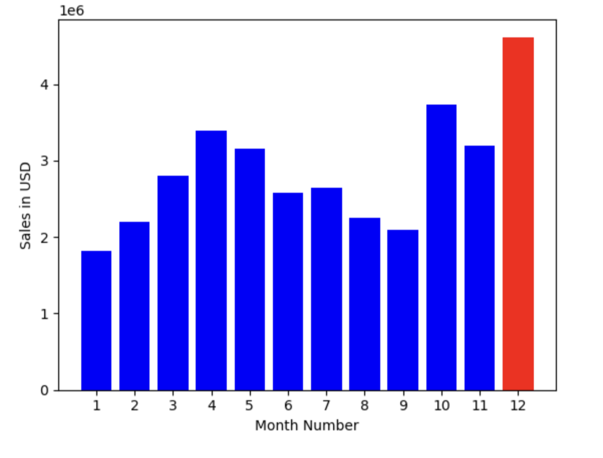
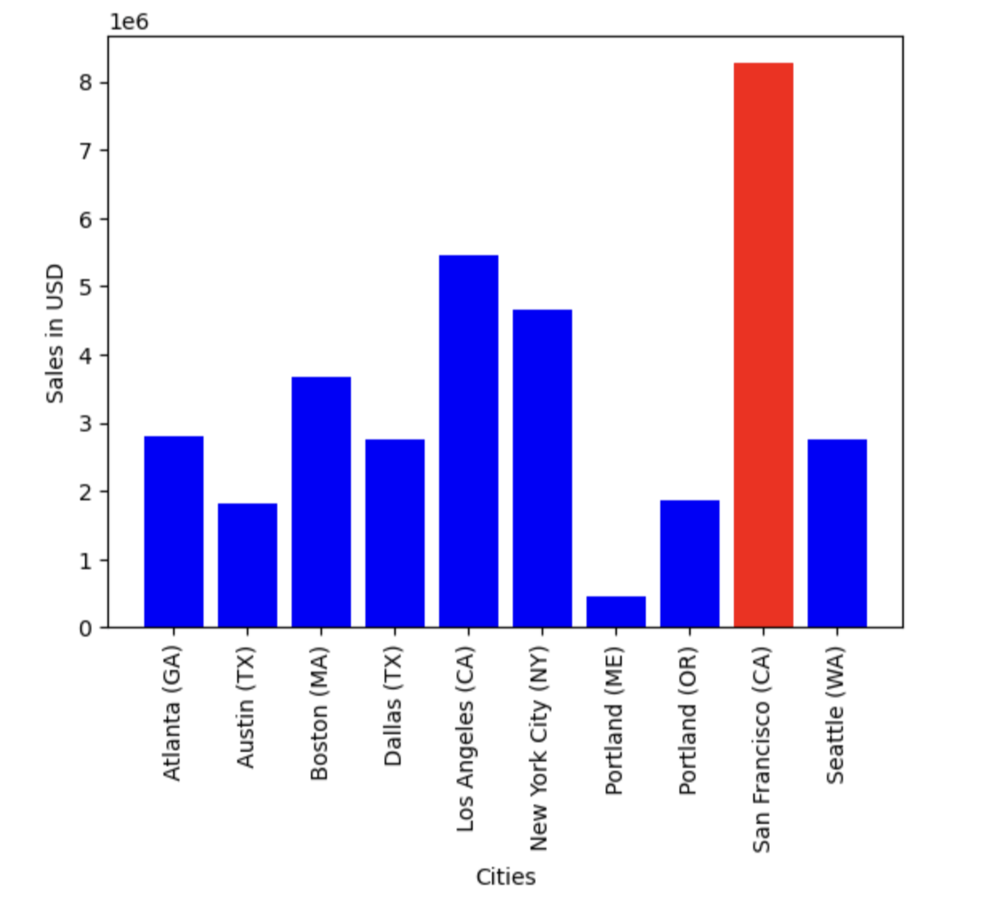

# Data Cleaning and Analysis with Python & Pandas

This project analyzes 12 months of sales data from an electronics store using **Python**, **Pandas**, and **Matplotlib**.  
It merges CSV files, cleans and preprocesses the data, and answers business questions through exploratory data analysis and visualizations.

## Key Highlights
- Merged and cleaned 12 CSV files into a single DataFrame with hundreds of thousands of rows.
- Answered 5 business questions, including sales trends, top-selling cities, and peak buying hours.
- Created bar and line plots for actionable business insights.

## Tools & Skills
- **Python**: Pandas, Matplotlib
- Data cleaning, preprocessing, and aggregation
- Exploratory data analysis (EDA)
- Data visualization 
